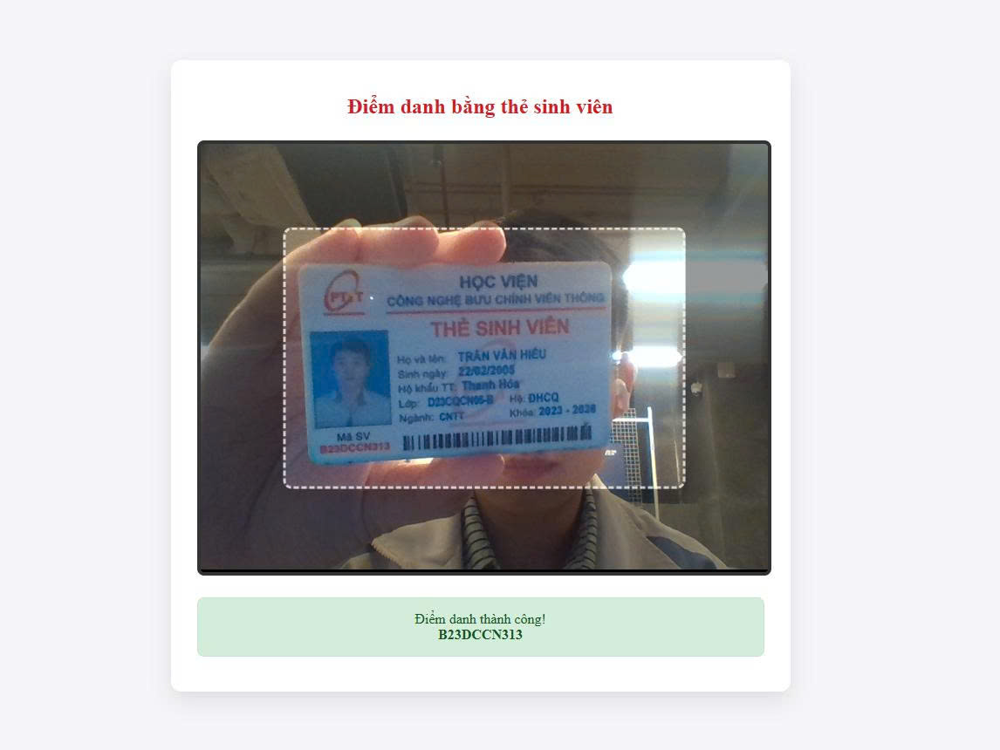

# Hệ thống điểm danh & nhận diện MSSV

<figure align="center">
  
  <figcaption><i>Giao diện điểm danh</i></figcaption>
</figure>

<figure align="center">
  
  <figcaption><i>Giao diện quản lí</i></figcaption>
</figure>

## 📋 Mô tả dự án

Hệ thống tự động điểm danh sinh viên bằng cách nhận diện và trích xuất thông tin từ thẻ sinh viên thông qua công nghệ nhận diện ảnh (AI). Hệ thống giúp tiết kiệm thời gian điểm danh và quản lý lịch sử điểm danh của sinh viên một cách hiệu quả.

## 💻 Công nghệ sử dụng

### AI & Computer Vision

- **YOLO (You Only Look Once):** Nhận diện và khoanh vùng (Object Detection) chính xác vị trí thẻ sinh viên trong khung hình.
- **OpenCV:** Tiền xử lý ảnh
- **PaddleOCR:** Trích xuất văn bản quang học (OCR)
- **Regex (Biểu thức chính quy):** Hậu xử lý dữ liệu

### Backend

- **FastAPI:** Xây dựng hệ thống RESTful API
- **SQLAlchemy:** ORM (Object-Relational Mapping) để tương tác an toàn và tiện lợi với cơ sở dữ liệu.
- **Pydantic:** Validation dữ liệu đầu vào/đầu ra chuẩn xác.

### Database

- **MySQL:** Lưu trữ thông tin sinh viên và lịch sử điểm danh với cấu trúc quan hệ

### Frontend

- **ReactJS:** Xây dựng giao diện Single-Page Application (SPA)
- **CSS & HTML:** Thiết kế giao diện người dùng
